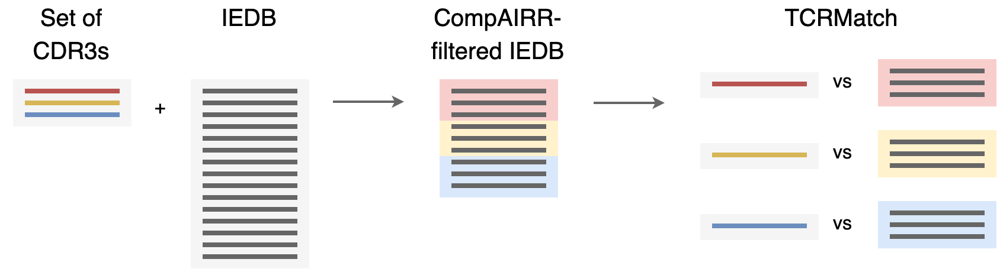
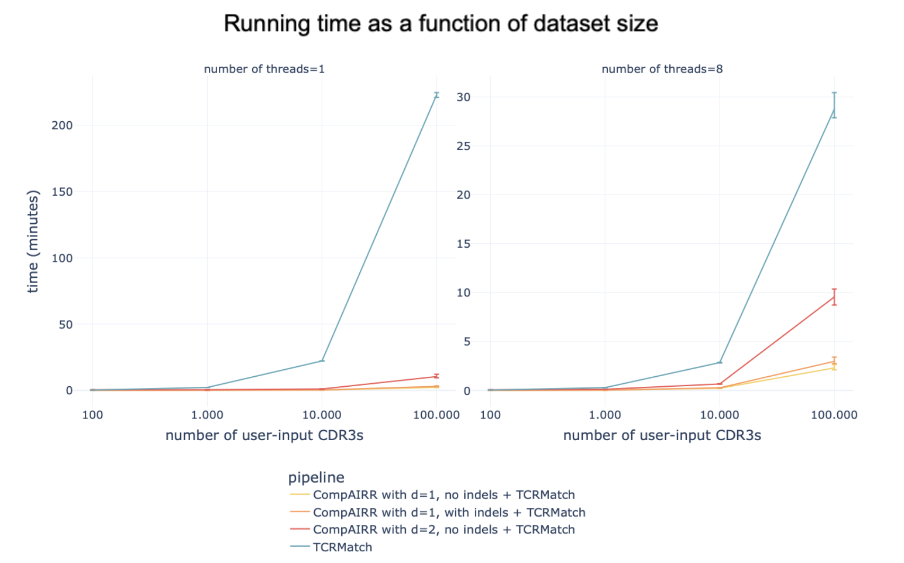
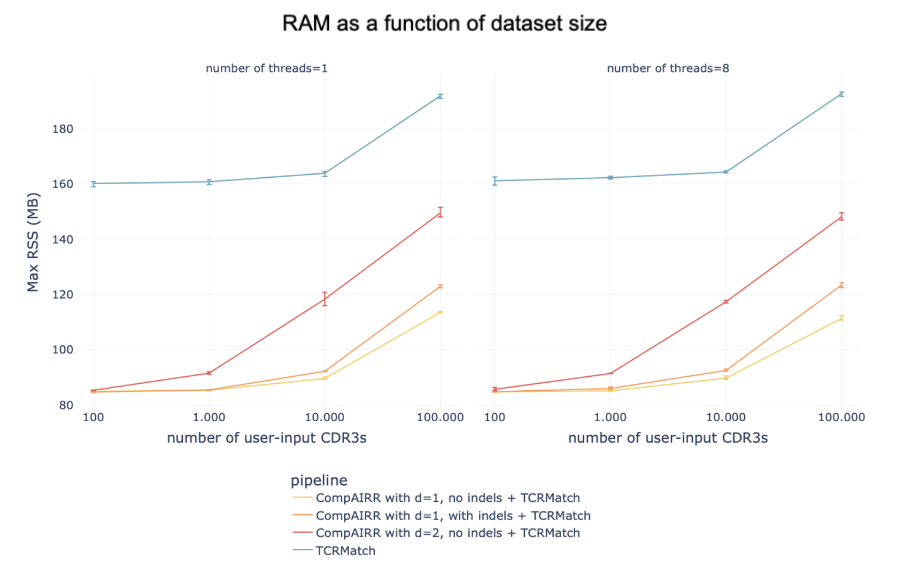
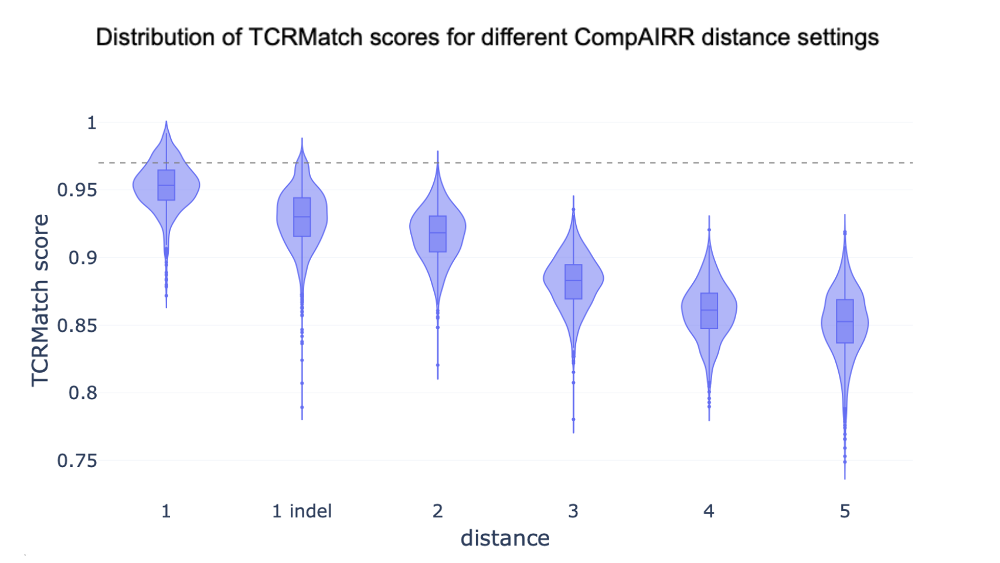

# CompAIRR + TCRMatch pipeline


TCRMatch is a tool which calculates similarity scores between user-provided TCR CDR3beta sequences and the receptors in the IEDB, 
and retrieves high-similarity matches. For large sets of query sequences, this can be computationally expensive. To speed up this 
process, this repository contains a pipeline which uses CompAIRR to pre-filter the reference set of IEDB sequences to only keep 
those within a given hamming distance from the query sequences. The output is formatted the same as standard TCRMatch output. 





The stand-alone CompAIRR+TCRMatch pipeline can be found in [tcrmatch_compairr_pipeline.py](scripts/tcrmatch_compairr_pipeline.py).
This script has a more developed user interface and provides checking of input parameter and user-friendly error messages.

### Compatibility and versioning

The pipeline has most recently been tested with TCRMatch version 1.3 and CompAIRR version 1.13.0. 
The included IEDB database file [IEDB_data_2026-05-01.tsv](data/IEDB_data_2026-05-01.tsv) has been updated May 1st, 2026. 


## Installation

See [TCRMatch](https://github.com/IEDB/TCRMatch) and [CompAIRR](https://github.com/uio-bmi/compairr) for installation of those tools.

The pipeline script only requires the installation of [pandas](https://pypi.org/project/pandas/):

```commandline
# conda
conda install -c conda-forge pandas
```

```commandline
# or PyPI
pip install pandas
```


## Usage


If CompAIRR and TCRMatch are installed in your environment (i.e., the tools can be run by simply typing `compairr` or `tcrmatch` in the command line interface), the pipeline can be run like this with default parameters:

```commandline
python scripts/tcrmatch_compairr_pipeline.py -u data/example_input.txt -e data/IEDB_data_2026-05-01.tsv -o example_output.txt
```

Alternatively, it may be easier to specify the paths to CompAIRR and TCRMatch: 

```commandline
python scripts/tcrmatch_compairr_pipeline.py -u data/example_input.txt -e data/IEDB_data_2026-05-01.tsv -o example_output.txt -c path/to/compairr-1.13.0/src/compairr -m path/to/TCRMatch-1.3/tcrmatch
```


The full help with command line options is given below. Parameters 'differences', 'indels' and 'threshold' can 
influence your match results (see [Guide for selecting distance parameters](#guide-for-selecting-distance-parameters)). 
Other parameters dictate speed, logging and debugging. 

```commandline

tcrmatch_compairr_pipeline.py [-h] -u USER_FILE -e IEDB_FILE -o OUTPUT_FILE [-d DIFFERENCES] [-t THREADS] [-i] [-s THRESHOLD] [-c COMPAIRR_PATH] [-m TCRMATCH_PATH] [-p TMP_PATH] [-k] [-z CHUNK_SIZE] [-l LOG_FILE]

options:
  -h, --help            show this help message and exit
  -u, --user_file USER_FILE
                        User input file containing newline separated CDR3beta amino acid sequences
  -e, --iedb_file IEDB_FILE
                        IEDB file, tab-separated file which should contain the following columns: cdr3_aa original_seq receptor_group epitopes source_organisms source_antigens
  -o, --output_file OUTPUT_FILE
                        Output filename for the TCRMatch results
  -d, --differences DIFFERENCES
                        CompAIRR setting: number of differences (default = 1)
  -t, --threads THREADS
                        CompAIRR setting: number of threads
  -i, --indels          CompAIRR setting: flag for enabling indels (default = no indels)
  -s, --threshold THRESHOLD
                        TCRMatch setting: parameter to specify the threshold (default = 0.97)
  -c, --compairr_path COMPAIRR_PATH
                        CompAIRR path (default = compairr)
  -m, --tcrmatch_path TCRMATCH_PATH
                        TCRMatch path (default = tcrmatch)
  -p, --tmp_path TMP_PATH
                        Temporary directory for storing log files and intermediate results (default = ./tmp)
  -k, --keep_intermediate
                        Flag for keeping intermediate results, useful for debugging (default = do not keep intermediate results)
  -z, --chunk_size CHUNK_SIZE
                        Chunk size for processing intermediate results (default = 100000)
  -l, --log_file LOG_FILE
                        File for logging progress with timestamps (default = ./log.txt)

```

## Benchmarking

### The CompAIRR+TCRMatch pipeline reduces time and memory usage 





### Guide for selecting distance parameters

TCRMatch only returns matches with a similarity core above a given threshold (0.97 by default). 

The CompAIRR step pre-filters the IEDB to only keep sequences within a given hamming/edit distance to the query sequence.
A smaller number of mismatches allowed by CompAIRR will improve computational efficiency, but could lead to the loss of
matches. 

The figure below shows the relationship between different CompAIRR distance cut-offs and the distribution of TCRMatch scores
between sequences with that distance. To retrieve all matches with a TCRMatch threshold of 0.97 (above the dashed line), 
one would need to consider a distance  1+indels (most matches) and 2 (all matches). Any larger distances (3, 4 or 5) will increase computational time but
won't retrieve more matches (these violin plots are all below the 0.97 threshold line).





### Benchmarking methods

To repeat the benchmarking, the script [benchmark.sh](scripts/compare_pipelines_version/benchmark.sh) should be used. 
Internally, the script uses the [GNU time command](https://www.gnu.org/software/time/) (`/usr/bin/time`) 
to benchmark the time (user, system, elapsed) and memory (maxrss) usage. 
Several paths must be specified at the beginning of the benchmarking script:
- iedb_input: the path to the IEDB database ([IEDB_data.tsv](data/IEDB_data_1may2026.tsv))
- compairr_iedb_input: path to an alternatively formatted IEDB database file, which uses column name 'cdr3_aa' instead of 'trimmed_seq' ([IEDB_for_compairr.tsv](data/IEDB.tsv))
- infiles_folder: folder where multiple user-input files are located. Their names must match the following pattern: n<number of sequences>_p<percentage iedb sequences>.tsv. For example: n1e3_p1.0.tsv. Each file must contain the 'cdr3_aa' header. ([infiles](data/benchmarking_data))
- output_folder: folder where benchmarking results will be stored. If this folder is already present, **it will be overwritten without warning**. 
- compairr_path: path to CompAIRR executable
- tcrmatch_path: path to TCRMatch executable
- compairr_tcrmatch_path: path to CompAIRR+TCRMatch python script

The current benchmarking pipeline is v6. The results for this pipeline can be found in the [benchmarking_results](benchmarking_results/benchmarking_v6) folder.
The benchmarking script will create two output folders: one folder contains all TCRMatch output files ([tcrmatch_outfiles](benchmarking_results/benchmarking_v6/tcrmatch_outfiles)),
the other folder contains the results of the GNU time command and CompAIRR log files ([time](benchmarking_results/benchmarking_v6/time)).
The script [plot_benchmarking_results.py](other_scripts/plot_benchmarking_results.py) can subsequently 
be used to make plots of the time results. Note: for pipeline v6 it is not possible anymore to get the 'breakdown'
of compairr vs file processing vs TCRMatch running time, as everything is now called from a single python script. 

